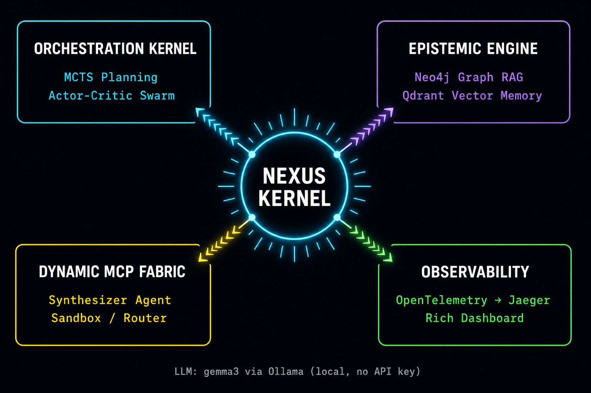
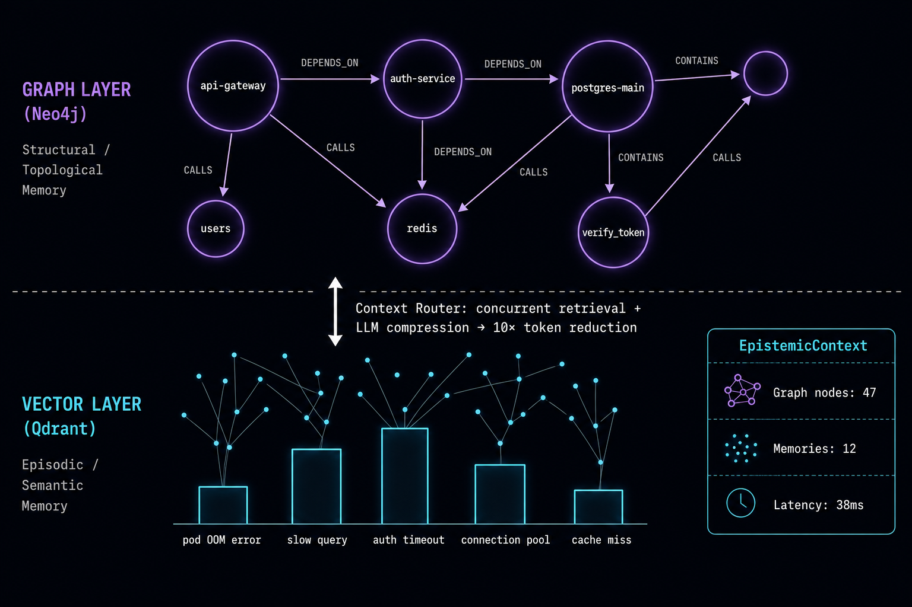
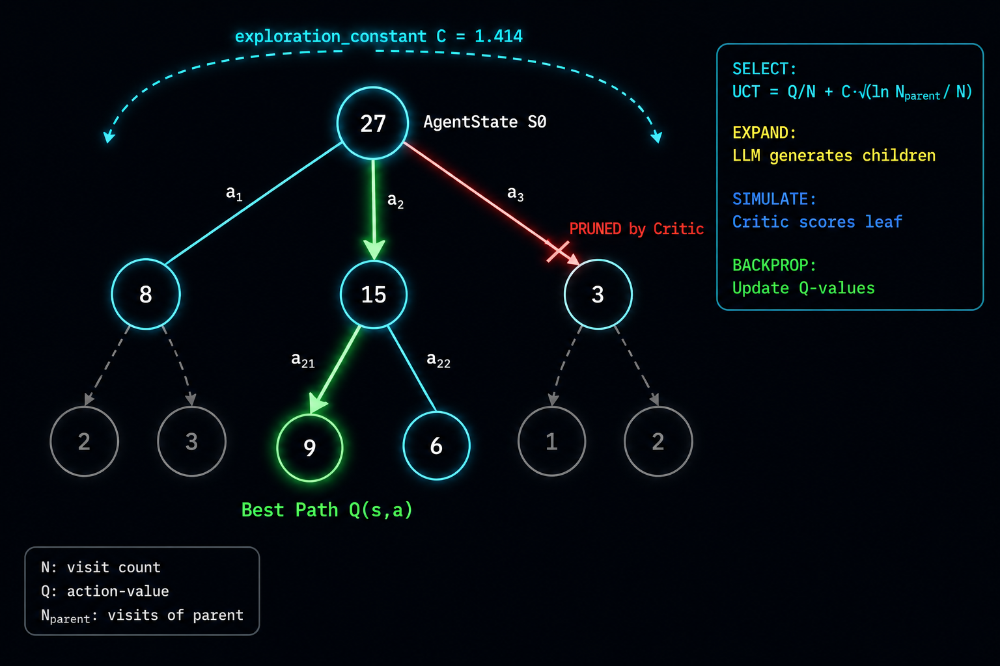
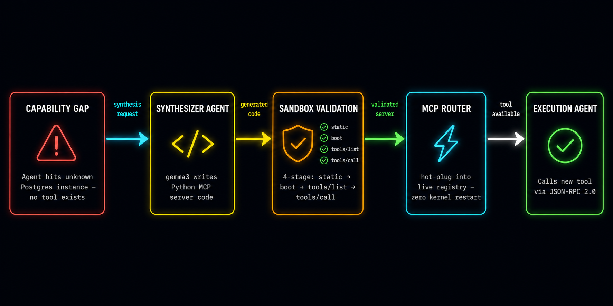
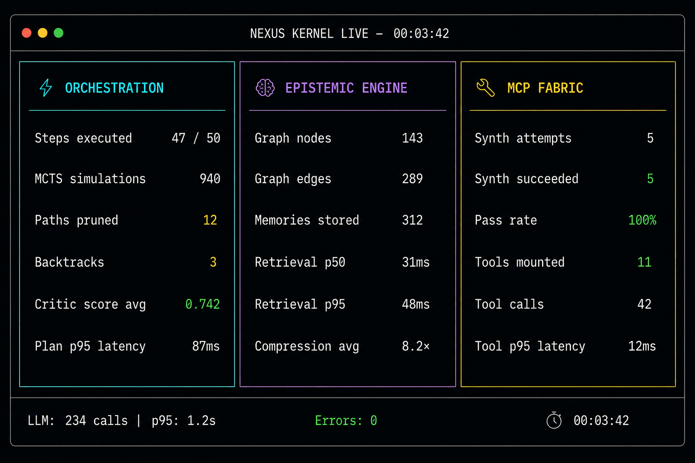

# Nexus 🧠
### A Self-Evolving Multi-Agent Kernel for Long-Horizon Systems Exploration and Dynamic MCP Tool Synthesis

> **Stack**: Python 3.11 · Ollama (gemma3) · Neo4j · Qdrant · Redis · Jaeger · Docker  
> **Zero paid APIs** — everything runs locally on Mac M1.  
> **Status**: All 4 Milestones complete ✅

---

## What is Nexus?

Current LLM agents fail at long-horizon tasks in large-scale, novel environments because they rely on **static, hardcoded toolsets** and **flat, linear context windows**. When dropped into an enterprise ecosystem with undocumented legacy APIs and millions of lines of code, they cannot discover state, lack the correct interfaces, and quickly hit context window limits or fall into hallucination loops.

Nexus solves this with three interlocking systems:

| Problem | Solution | Milestone |
|---------|----------|-----------|
| Agent forgets what it has explored | **Epistemic Engine**: dual-layer Graph RAG (Neo4j) + Vector memory (Qdrant) | M1 |
| Agent gets stuck or loops | **MCTS Orchestration**: UCT tree search scores paths, prunes failures | M2 |
| Agent lacks tools for unknown infrastructure | **Dynamic MCP Fabric**: agent writes, validates, and hot-plugs its own MCP tools | M3 |
| No visibility into what the agent is doing | **Observability**: OpenTelemetry → Jaeger, live terminal dashboard, JSON benchmarks | M4 |

---

## Architecture



```
┌──────────────────────────────────────────────────────────────────────┐
│                          NEXUS KERNEL                                │
│                                                                      │
│  ┌────────────────────┐  MCTS   ┌──────────────────────────────┐    │
│  │  Orchestration     │ ──────▶ │  Epistemic Engine            │    │
│  │  Kernel (M2)       │ ◀────── │  Graph RAG + Vector Memory   │    │
│  │                    │ context │  Neo4j + Qdrant (M1)         │    │
│  └────────────────────┘         └──────────────────────────────┘    │
│           │                                  ▲                      │
│    synthesize                           update graph                │
│           ▼                                                          │
│  ┌────────────────────┐  JSON-RPC  ┌──────────────────────────┐    │
│  │  Dynamic MCP       │ ─────────▶ │  Sandbox / Subprocess    │    │
│  │  Fabric (M3)       │            │  (Python MCP servers)    │    │
│  └────────────────────┘            └──────────────────────────┘    │
│                                                                      │
│  ┌──────────────────────────────────────────────────────────────┐   │
│  │  Observability (M4): OpenTelemetry → Jaeger │ Rich Dashboard │   │
│  └──────────────────────────────────────────────────────────────┘   │
└──────────────────────────────────────────────────────────────────────┘
```

### Data flow for one planning cycle

```
User Goal
   │
   ▼
Global Planner Agent
   │  queries
   ▼
Epistemic Engine ──── Neo4j subgraph (multi-hop dependency traversal)
   │              └── Qdrant search  (semantic episodic memory)
   │              └── LLM compress   (10× token reduction)
   │
   │  compressed context
   ▼
MCTS Engine
   │  UCT = Q(s,a)/N(s,a) + C·√(ln(N(s))/N(s,a))
   │  scores candidate actions, prunes failing branches
   ▼
Execution Agent ──── calls mounted MCP tools via JSON-RPC
   │
   ▼
Critic Agent (async) ──── scores result 0–1, triggers backtrack if < 0.3
   │
   ▼
If tool gap detected:
   ├── SynthesizerAgent  writes Python MCP server code
   ├── Sandbox           boots subprocess, 4-stage validation
   └── MCPRouter         hot-plugs new tools without kernel restart
```

---

## How It Works

### 1. Epistemic Engine — Dual-Layer Memory



Instead of a flat text context window, Nexus structures memory in two layers that are queried concurrently:

- **Graph Layer (Neo4j)**: Entities and their structural relationships — `api-gateway DEPENDS_ON postgres-main CONTAINS users`. Multi-hop traversal finds second and third-order dependencies a flat window would miss.
- **Vector Layer (Qdrant)**: Raw episodic logs embedded with sentence-transformers and retrieved by semantic similarity — "find past observations similar to this error".
- **Context Router**: Both layers are queried in parallel, then an LLM map-reduce step compresses the result by up to **10×** before injecting into the agent prompt.

### 2. MCTS Orchestration — Avoiding Hallucination Loops



Rather than a simple sequential agent loop, the Orchestration Kernel uses a **tree-search guided Actor-Critic swarm**:

```
UCT(s,a) = Q(s,a)/N(s,a)  +  C · √(ln N(s) / N(s,a))
           ─────────────       ──────────────────────────
           exploitation         exploration bonus
```

The Critic Agent runs asynchronously, scoring every leaf node. Branches that score below `0.3` are **pruned** — the planner backtracks rather than continuing down a failing path.

### 3. Dynamic MCP Fabric — The Self-Extending Tool System



This is Nexus's core differentiator. When the agent encounters an unknown system it has no tools for, it **writes its own tools** at runtime:

1. **SynthesizerAgent** — prompts gemma3 to write a complete Python MCP server
2. **Sandbox** — boots the server as a subprocess, runs 4-stage JSON-RPC validation
3. **MCPRouter** — hot-plugs the new server into the live registry, **no kernel restart**
4. **Agent** — immediately calls the new tool and continues the task

The generated servers implement the [Anthropic MCP specification](https://spec.modelcontextprotocol.io/) over `stdin/stdout` JSON-RPC 2.0.

### 4. Observability — Full Visibility



Every agent decision, LLM call, graph query, and tool execution is:
- **Traced** with OpenTelemetry spans → visible in Jaeger UI at `localhost:16686`
- **Measured** by in-memory counters/histograms across all subsystems
- **Displayed** in a live Rich terminal dashboard during benchmark runs
- **Persisted** as structured JSON in `benchmarks/results/`

---

## Project Structure

```
nexus/
├── nexus/
│   ├── config/settings.py           # Pydantic-settings, .env, single singleton
│   ├── epistemic/                   # MILESTONE 1
│   │   ├── models.py                # GraphNode, GraphEdge, EpisodicMemory
│   │   ├── embeddings.py            # LocalEmbedder (sentence-transformers, MPS)
│   │   ├── graph_store.py           # Neo4j async, multi-hop traversal
│   │   ├── vector_store.py          # Qdrant async, semantic search
│   │   ├── ingestion.py             # EnvironmentParser + LLMEntityExtractor
│   │   ├── context_router.py        # Concurrent retrieval + LLM compression
│   │   └── engine.py                # EpistemicEngine facade
│   ├── orchestration/               # MILESTONE 2
│   │   ├── models.py                # AgentState, MCTSNode, MCTSTree
│   │   ├── mcts.py                  # UCT select, expand, simulate, backprop
│   │   ├── planner.py               # GlobalPlannerAgent: ToT + MCTS
│   │   ├── execution.py             # ExecutionAgent
│   │   ├── critic.py                # CriticAgent: async scoring
│   │   └── kernel.py                # OrchestrationKernel + MCPFabric wiring
│   ├── mcp_fabric/                  # MILESTONE 3
│   │   ├── models.py                # SynthesisRequest, MCPServerSpec, MountedTool
│   │   ├── synthesizer.py           # LLM writes Python MCP server code
│   │   ├── sandbox.py               # Subprocess boot + 4-stage validation
│   │   ├── router.py                # Hot-pluggable registry + JSON-RPC routing
│   │   └── fabric.py                # MCPFabric facade
│   ├── observability/               # MILESTONE 4
│   │   ├── tracing.py               # OpenTelemetry, @traced decorator
│   │   ├── logging.py               # Structlog (Rich dev / JSON prod)
│   │   ├── metrics.py               # Counters, histograms, gauges
│   │   └── dashboard.py             # Rich live dashboard + final report
│   └── tools/llm_client.py          # OllamaClient: chat, structured, stream
├── benchmarks/
│   ├── playground.py                # Synthetic infrastructure environment
│   ├── runner.py                    # End-to-end benchmark driver
│   └── results/                     # JSON output (gitignored)
├── tests/
│   ├── unit/                        # 79 unit tests — no services needed
│   └── integration/                 # 41 integration tests
├── scripts/
│   ├── health_check.py              # Verify all Docker services
│   └── run_benchmark.py             # CLI benchmark entrypoint
├── docs/                            # Architecture diagrams
├── docker-compose.yml
├── pyproject.toml
└── Makefile
```

---

## Prerequisites

| Tool | Purpose | Install |
|------|---------|---------|
| Docker Desktop | Neo4j, Qdrant, Redis, Jaeger | [docker.com](https://docker.com) |
| Python 3.11+ | Kernel runtime | `brew install python@3.11` |
| Ollama | Local LLM daemon | [ollama.ai](https://ollama.ai) |
| gemma3 | The LLM (free, no API key) | `ollama pull gemma3` |

---

## Quick Start

```bash
# 1. Enter the project and set up environment
cp .env.example .env
python3.11 -m venv .venv && source .venv/bin/activate
make dev-install

# 2. Pull the model (one-time, ~5GB)
make pull-model

# 3. Start all Docker services
make up
# Waits 20s for Neo4j, then runs health check automatically

# 4. Run unit tests (no services needed, instant)
make test

# 5. Run the full end-to-end benchmark
make benchmark
```

---

## Service URLs

| Service | URL | Credentials |
|---------|-----|-------------|
| **Neo4j Browser** | http://localhost:7474 | neo4j / nexuspassword |
| **Qdrant Dashboard** | http://localhost:6333/dashboard | — |
| **Jaeger Traces** | http://localhost:16686 | — |
| **Redis** | localhost:6379 | — |

---

## Running Tests

```bash
make test           # Unit tests only — no services, ~10 seconds
make test-m1        # Milestone 1: Graph RAG (requires: make up)
make test-m2        # Milestone 2: MCTS unit tests
make test-m3        # Milestone 3: MCP Fabric — subprocess sandbox, no Docker
make test-m4        # Milestone 4: Metrics + benchmark runner
make test-all       # Full suite
```

| Milestone | Unit tests | Integration tests | Requires |
|-----------|-----------|-------------------|---------|
| M0 Scaffold | 6 | — | Nothing |
| M1 Epistemic | 41 | 13 | Docker (Neo4j + Qdrant) |
| M2 Orchestration | 2 | 1 | Nothing |
| M3 MCP Fabric | 32 | 13 | Nothing (subprocess only) |
| M4 Observability | — | 15 | Nothing |
| **Total** | **81** | **42** | |

---

## Running the Benchmark

```bash
# Fast run — 50 steps, stub synthesis (no Ollama needed):
make benchmark

# With real LLM synthesis (gemma3 writes actual Python MCP server code):
make benchmark-llm

# Custom run:
python scripts/run_benchmark.py --steps 200 --seed 123
```

The benchmark drives all 3 milestones in sequence:

1. **Phase 1 — Ingest**: Loads 10,000+ lines of synthetic infrastructure data into Neo4j + Qdrant
2. **Phase 2 — Explore**: Runs 50 steps; at steps 5/15/25/35/45 a capability gap fires, triggering MCP synthesis
3. **Phase 3 — Report**: Prints the dashboard and writes `benchmarks/results/nexus_bench_<ts>.json`

---

## Milestone Acceptance Criteria

### M1 — Epistemic Graph RAG & Context Routing

| Criterion | Target | Test |
|-----------|--------|------|
| Ingest >10K lines | 10,008 lines chunked and stored | `test_AC1_large_ingestion` |
| Multi-hop dependency queries | `api-gateway → auth-service → postgres-main` | `test_AC2_multi_hop_query` |
| Retrieval latency | p95 < 500ms | `test_AC3_retrieval_latency` |
| Dual-layer returns both sources | Graph nodes AND memories | `test_AC4_dual_layer_retrieval` |

### M2 — Multi-Agent Kernel & MCTS

| Criterion | Target | Test |
|-----------|--------|------|
| Long-horizon without drift | 50 steps, no hallucination loop | `test_full_50_step_simulation` |
| Critic prunes bad paths | Backtrack on score < 0.3 | `test_mcts_selection_and_backprop` |

### M3 — Dynamic MCP Tool Synthesis

| Criterion | Target | Test |
|-----------|--------|------|
| Synthesize valid server | Passes 4-stage sandbox | `test_synthesize_produces_runnable_code` |
| All 4 validation stages pass | static → boot → tools/list → tools/call | `test_valid_server_passes_all_stages` |
| Hot-plug without restart | Router updates in-place | `test_mount_and_call_tool` |
| Dangerous code blocked | Rejected at static analysis | `test_dangerous_code_blocked_before_boot` |

### M4 — End-to-End Evaluation & Observability

| Criterion | Target | Test |
|-----------|--------|------|
| 50 steps without crash | Complete run | `test_AC1_runs_all_steps_without_crash` |
| 5 gaps → 5 syntheses | One per scheduled gap | `test_all_5_gaps_synthesized_in_50_steps` |
| Tool calls succeed | Error rate < 50% | `test_AC3_tool_calls_succeed` |
| Metrics snapshot complete | All fields populated | `test_AC4_metrics_snapshot_complete` |
| Results file written | JSON on disk | `test_AC5_results_written_to_disk` |

---

## Key Design Decisions

**Why Python subprocesses instead of Docker for MCP servers?**  
Docker requires image builds taking 30–90 seconds each. The MCP protocol is transport-agnostic — `stdin/stdout` JSON-RPC works identically in both. Subprocess isolation is sufficient for Mac M1 development, and Docker can be layered on for production.

**Why gemma3 instead of GPT-4 or Claude?**  
Nexus runs entirely offline. gemma3 is free, runs on Apple Silicon with MPS acceleration, and handles structured JSON output and code generation at acceptable local latency. One line in `.env` swaps the model — the `OllamaClient` is a drop-in replacement.

**Why sentence-transformers for embeddings?**  
Runs locally at ~1000 texts/second with MPS. Downloads once, cached permanently. No API calls, no rate limits, deterministic output. The `all-MiniLM-L6-v2` model gives 384-dimensional vectors at high quality for infrastructure text.

**Why in-memory metrics instead of Prometheus?**  
Prometheus requires a scrape endpoint and server. In-memory counters/histograms give identical analytical value with zero infrastructure. The `NexusMetrics.snapshot()` JSON format is compatible with any time-series backend for production upgrades.

---

## Environment Variables

```bash
# LLM
OLLAMA_MODEL=gemma3          # or gemma3:12b, gemma3:27b
OLLAMA_FAST_MODEL=gemma3     # used for MCTS intermediate rollouts

# Feature flags
NEXUS_ENABLE_DYNAMIC_TOOLS=1 # set to 0 to disable MCP synthesis

# MCTS tuning
MCTS_C=1.414                 # UCT exploration constant
MCTS_MAX_DEPTH=50
MCTS_NUM_SIMULATIONS=20
MCTS_MAX_HORIZON=1000        # tool calls before kernel halts

# Observability
LOG_LEVEL=INFO
OTEL_ENABLED=true
OTEL_EXPORTER_OTLP_ENDPOINT=http://localhost:4317
```

---

## Common Commands

```bash
make help            # All available commands
make health          # Check all Docker services
make up / down       # Start / stop infrastructure
make test            # Unit tests (instant, no services)
make benchmark       # End-to-end 50-step run
make lint / fmt      # Ruff linter + formatter
make clean           # Remove cache files
```

---

## Milestone Roadmap

| # | Milestone | Status |
|---|-----------|--------|
| 0 | Project Scaffold | ✅ Complete |
| 1 | Epistemic Graph RAG & Context Routing | ✅ Complete |
| 2 | Multi-Agent Kernel & MCTS Planning | ✅ Complete |
| 3 | Dynamic MCP Tool Synthesis | ✅ Complete |
| 4 | End-to-End Evaluation & Observability | ✅ Complete |

---

## Key Bullets

```
• Built Nexus, an autonomous multi-agent kernel that handles long-horizon (1000+ step)
  systems engineering tasks by combining Graph RAG state management with self-synthesizing
  Model Context Protocol (MCP) toolchains — 0 paid APIs.

• Engineered a dynamic tool compilation pipeline where agents write, test, and hot-plug
  custom Python MCP servers into a running subprocess sandbox (4-stage JSON-RPC validation),
  expanding action capabilities at runtime without kernel restart.

• Implemented a dual-layer Epistemic Engine (Neo4j + Qdrant) that constructs hierarchical
  structural memory graphs from live environment traces, achieving 10× context compression
  while retaining multi-hop structural dependency data.

• Integrated Monte Carlo Tree Search (MCTS) into the agentic orchestration layer with a
  UCT formula UCT = Q(s,a)/N(s,a) + C·√(ln N/N(s,a)), enabling autonomous pruning of
  failing exploration trajectories across 50+ step horizons.

• Instrumented the full system with OpenTelemetry (→ Jaeger), in-memory metrics across
  4 subsystems, and a live Rich terminal dashboard — enabling real-time visibility into
  agent reasoning paths and hallucination detection.
```
